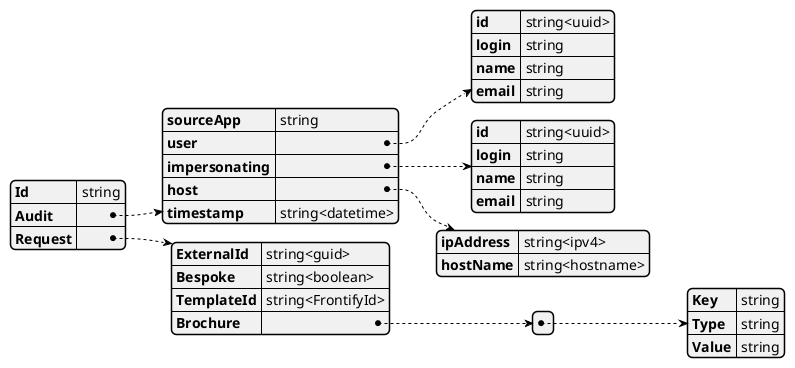
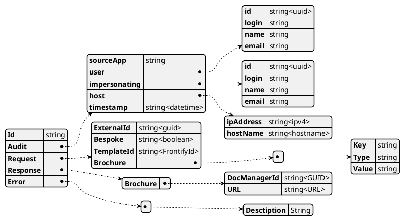

# Domain Logic Component

The domain logic will handle requests from both Service Bus and Ad-hoc via a RESTful API interface. Audit enquires will be routed to the audit component.

## Flowchart

## Schemas and Maps

This service takes a standard integration approach to mapping internal and external data structures, this design breaks dependencies so that the external interface may change without affecting internal systems.

Objects received from interfaces should follow a standard VETER integration pattern (Validate, Extract, Transform, Enrich, Route)

* Validate
  * Objects should be validated and a default rules set should be applied to validate the object.
* Extract
  * Extract specific information from the message, such as audit etc.
* TransForm
  * The Message should be transformed into the next type in the process.
* Enrich
  * Adds additional data to the message, often from external sources
* Route
  * Directs the processed message to the appropriate destination based on certain criteria.

## Brochure Generation

### Request Schema

### Validation Rules

* Given : A Brochure Generation Request
* When : ID is a GUID
* AND : Audit Is Valid
  * SourceApp is not Null
  * User is not Null
  * host is not Null
  * TimeStamp is valid today, current hour
* AND : Request is Valid
  * ExternalId is not Null, GUID
  * Bespoke is True or False
  * TemplateId is Frontify Id
  * Brochure array is Valid
    * Array of Key/Type/Value tuples
* Then : I can generate a brochure

### Response Schema

